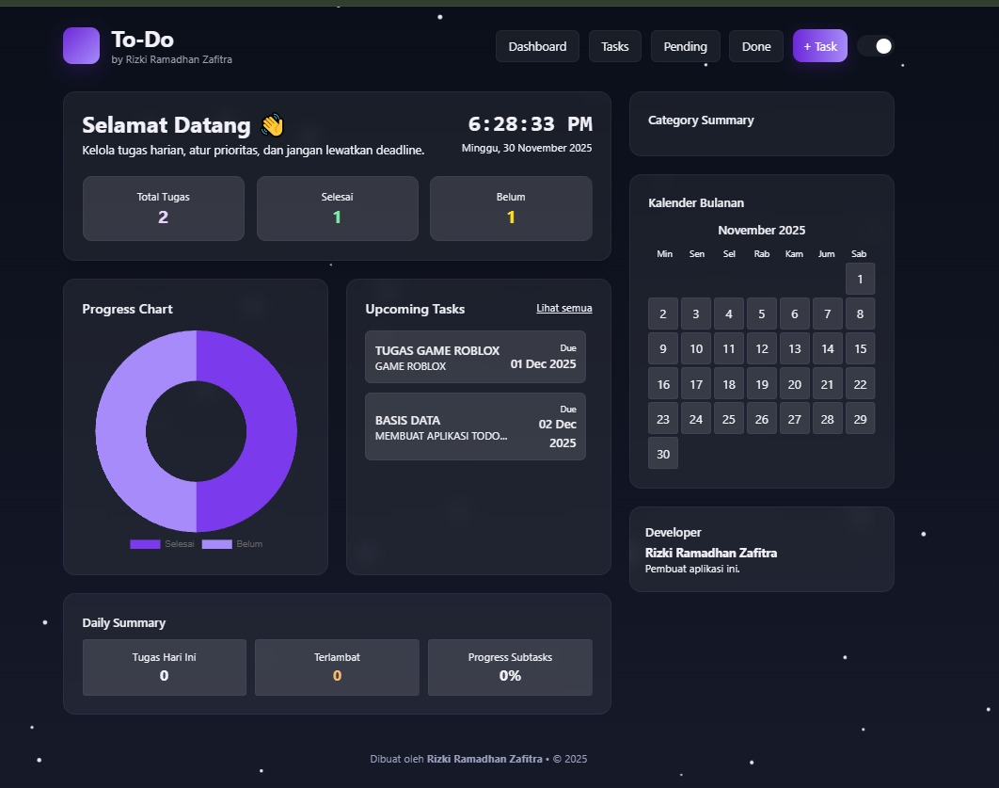

<p align="center">
  
</p>

<h1 align="center">To-Do List App — Modern Student Productivity</h1>

<p align="center">
  <strong>For Students • By Rizki Ramadhan Zafitra</strong><br>
  A modern productivity web app to manage tasks, deadlines, and academic goals.
</p>

---

## 🚀 Tech Stack

<p align="center">
  
</p>

### 🔧 **Framework & Bahasa yang digunakan:**
- **Laravel 10 / 12** (Backend)
- **PHP 8** (Backend language)
- **MySQL** (Database)
- **TailwindCSS** (UI Styling)
- **JavaScript ES6** (Interactivity)
- **Blade Templates** (Laravel Frontend Engine)

---

## 📝 Tentang Project

Aplikasi **To-Do List** ini dirancang khusus untuk pelajar / mahasiswa untuk:

- Mengelola tugas harian  
- Melihat progress belajar  
- Mengingat deadline  
- Menampilkan visualisasi tugas dengan grafik & kalender  

UI dibuat dengan tema **dark ungu futuristik**, lengkap dengan:

✨ Glassmorphism  
✨ Mode gelap & terang  
✨ Progress chart modern  
✨ Kalender Indonesia lengkap  
✨ Animasi partikel aesthetic  

---

## 🌟 Fitur Utama

### ✔ Dashboard Modern
- Statistik tugas lengkap
- Progress Chart (Chart.js)
- Upcoming Tasks
- Daily Summary
- Kalender Bulanan Real-Time (Libur Nasional Indonesia)
- Dark / Light Mode

### ✔ Manajemen Tugas
- Tambah, Edit, Delete
- Mark as Done / Pending
- Priority label (Low, Medium, High)
- Deadline tampil rapi
- Progress Subtasks
- Kategori tugas

### ✔ UI Aesthetic Futuristik
- Desain ala Notion & Linear
- Glassmorphism effect
- Warna ungu neon premium
- Sangat responsif untuk mobile

---

## 📸 Preview UI

### 🔹 Dashboard  
<p align="center">
  
</p>

---

## ⚙️ Instalasi

### 1️⃣ Clone Repository
```bash
git clone https://github.com/rizzneverwin/to-do-list.git
cd to-do-list
